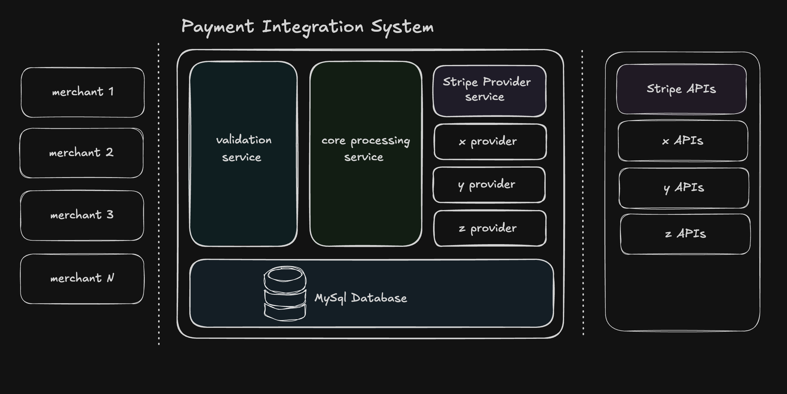
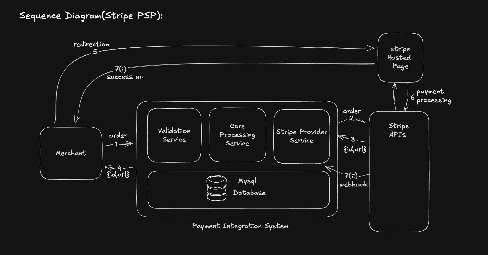

## Diagrams

<caption>
Payment Integration System Block Diagram

</caption>

<caption> Stripe PSP Sequence Diagram

</caption>

## Microservice Architecture

    
Validation Service

    
Core-Processing Service

    
Stripe-Provider Service

 
service that will integrate with stripe apis and provide payment functionalities

| Method | endpoint                  |  RequestBody           |  RequestParams      |
|--------|---------------------------|------------------------|---------------------|
| POST   | /api/v1/payment           |CreatePaymentRequest    |nil                  |
| GET    | /api/v1/payment           |nil                     |ref                  |
| POST   | /api/v1/payment/expire    |nil                     |ref                  |

    
mysql database

## Useful Links:
- [Stripe Checkout Session](https://docs.stripe.com/payments/checkout/how-checkout-works)
- [Stripe APIs](https://docs.stripe.com/api)

